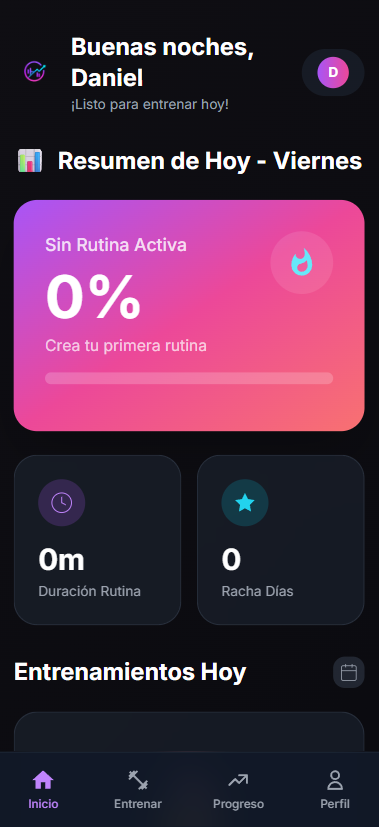
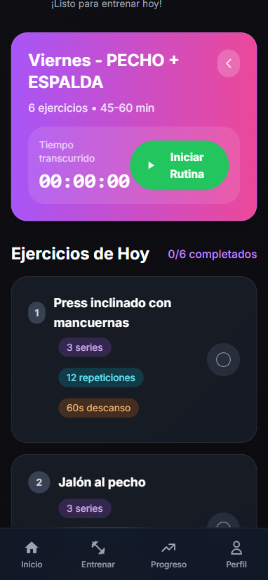
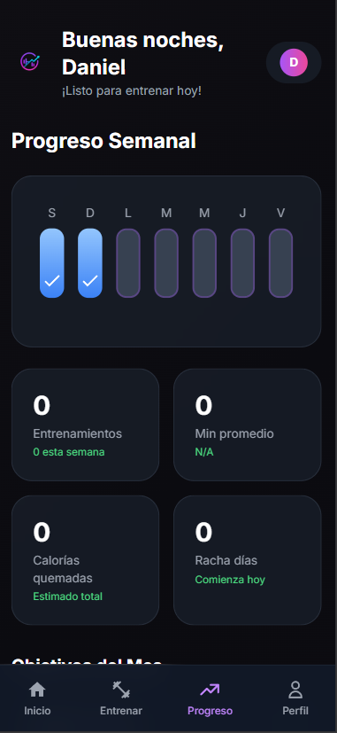
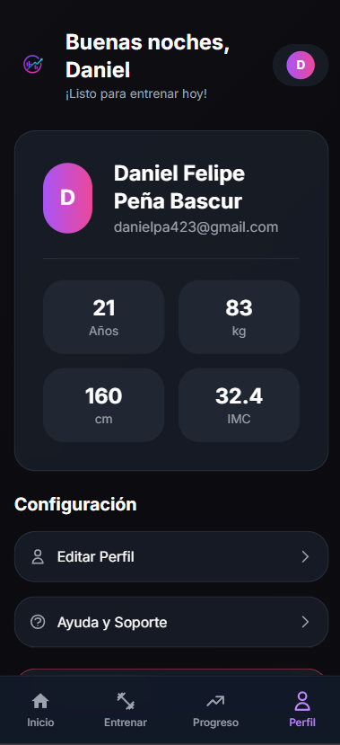

# 🏋️‍♂️ GymTiva - Control de Rutinas

**GymTiva** es una aplicación web moderna desarrollada con Next.js 15 y TypeScript que te permite llevar un control completo de tus rutinas de gimnasio con el sistema profesional **ExoticoTramax**, seguimiento de progreso en tiempo real y estadísticas avanzadas.

## 📱 Screenshots de la Aplicación

### 🏠 Dashboard Principal
El dashboard muestra tu progreso diario, estadísticas de la semana y acceso rápido a tu rutina activa.



### 💪 Gestión de Rutinas
Visualiza y administra todas tus rutinas de entrenamiento con información detallada de progreso.



### 🏋️‍♂️ Sesión de Entrenamiento
Interfaz intuitiva para marcar ejercicios completados con cronómetro en tiempo real.


### 📊 Página de Progreso
Seguimiento visual de tu rendimiento semanal y estadísticas de calorías quemadas.



### 👤 Perfil de Usuario
Gestiona tu información personal y configuración de la aplicación.



---

## ✨ Funcionalidades Implementadas

### 🎯 Sistema de Autenticación
- ✅ **Registro e inicio de sesión** con JWT
- ✅ **Protección de rutas** con middleware
- ✅ **Persistencia de sesión** con cookies seguras
- ✅ **Validación de usuario** en tiempo real

### 💪 Rutinas ExoticoTramax
- ✅ **Rutina profesional de 4 semanas** con alternancia de grupos musculares
- ✅ **Patrón de entrenamiento inteligente** (Semanas 1-3 iguales, Semanas 2-4 iguales)
- ✅ **Rutina de 5 días por semana** (Lunes a Viernes) con descanso de fin de semana
- ✅ **Ejercicios específicos por día**: Pecho+Espalda, Piernas, Hombros+Brazos, etc.
- ✅ **Cardio integrado** de 15-30 minutos por sesión
- ✅ **Progresión automática** por semanas y días

### ⏱️ Cronómetro y Sesiones
- ✅ **Cronómetro en tiempo real** durante entrenamientos
- ✅ **Seguimiento de ejercicios individuales** con checkbox de progreso
- ✅ **Inicio manual de sesiones** con botón de play
- ✅ **Finalización de rutinas** con confirmación y actualización automática
- ✅ **Tiempo transcurrido** visible durante toda la sesión

### 📊 Progreso y Estadísticas Reales
- ✅ **Dashboard inteligente** que muestra entrenamientos del día actual
- ✅ **Progreso semanal visual** con indicadores de días completados
- ✅ **Cálculo de racha de días consecutivos** basado en datos reales
- ✅ **Estadísticas de calorías quemadas** calculadas automáticamente
- ✅ **Progreso de rutina en porcentaje** actualizado en tiempo real
- ✅ **Objetivos mensuales** con barras de progreso dinámicas

### 🗄️ Base de Datos y API
- ✅ **MongoDB Atlas** con esquemas complejos de rutinas
- ✅ **API RESTful completa** para crear, leer y actualizar rutinas
- ✅ **Modelos de datos estructurados** para semanas, días y ejercicios
- ✅ **Persistencia de progreso** con actualizaciones automáticas
- ✅ **Manejo de errores robusto** en todas las operaciones

### 🎨 Interfaz y UX
- ✅ **Diseño glassmorphism moderno** con efectos de desenfoque
- ✅ **Tema oscuro profesional** con gradientes de colores
- ✅ **Navegación bottom bar** optimizada para móvil
- ✅ **Estados condicionales** (botones deshabilitados hasta crear rutina)
- ✅ **Feedback visual inmediato** en todas las acciones
- ✅ **Responsive design** que funciona perfecto en todos los dispositivos

### 🔄 Gestión de Estado Global
- ✅ **React Context** para manejo de estado de rutinas
- ✅ **Datos en tiempo real** sincronizados en toda la app
- ✅ **Carga optimizada** con estados de loading y error
- ✅ **Refetch automático** después de completar entrenamientos

---

## 🚧 Funcionalidades Pendientes

### 📈 Analíticas Avanzadas
- ⏳ **Gráficos de progreso histórico** con Chart.js
- ⏳ **Comparativas mes a mes** de rendimiento
- ⏳ **Análisis de grupos musculares** más trabajados
- ⏳ **Predicciones de progreso** basadas en IA

### 🍎 Sistema de Nutrición
- ⏳ **Registro de comidas diarias** por tipo de comida
- ⏳ **Base de datos de alimentos** con información nutricional
- ⏳ **Cálculo automático de macronutrientes** (proteínas, carbohidratos, grasas)
- ⏳ **Scanner de códigos de barras** para alimentos
- ⏳ **Recomendaciones nutricionales** personalizadas

### 💧 Hidratación y Bienestar
- ⏳ **Seguimiento de ingesta de agua** con recordatorios
- ⏳ **Control de peso corporal** con gráficos de tendencia
- ⏳ **Registro de horas de sueño** para optimizar recovery
- ⏳ **Medidas corporales** (cintura, brazos, piernas, etc.)

### 🏆 Gamificación y Social
- ⏳ **Sistema de logros y badges** por metas alcanzadas
- ⏳ **Desafíos semanales** personalizados
- ⏳ **Comparación con amigos** y leaderboards
- ⏳ **Sharing en redes sociales** de logros

### 🤖 Inteligencia Artificial
- ⏳ **Recomendaciones de ejercicios** basadas en historial
- ⏳ **Ajuste automático de pesos** según progreso
- ⏳ **Detección de plateaus** y sugerencias de cambio
- ⏳ **Asistente virtual** para dudas sobre ejercicios

### � Aplicación Móvil Nativa
- ⏳ **App para iOS y Android** con React Native
- ⏳ **Notificaciones push** para recordatorios
- ⏳ **Modo offline** para entrenamientos sin internet
- ⏳ **Integración con Apple Health / Google Fit**

### 🎵 Entretenimiento y Motivación
- ⏳ **Integración con Spotify** para música durante entrenamientos
- ⏳ **Videos de ejercicios** con técnica correcta
- ⏳ **Temporizadores de descanso** personalizables
- ⏳ **Frases motivacionales** durante entrenamientos

---

## 🛠️ Tecnologías Utilizadas

### Frontend
- **Next.js 15.5.4** - Framework React con App Router
- **TypeScript** - Tipado estático para mayor robustez
- **Tailwind CSS** - Estilos utility-first para diseño moderno
- **React Context** - Manejo de estado global
- **Lucide React** - Iconos SVG optimizados

### Backend y Base de Datos
- **MongoDB Atlas** - Base de datos NoSQL en la nube
- **Mongoose** - ODM para modelado de datos
- **JWT (jsonwebtoken)** - Autenticación y autorización
- **bcryptjs** - Encriptación de contraseñas

### DevOps y Deployment
- **Vercel** - Hosting optimizado para Next.js
- **Git** - Control de versiones
- **ESLint** - Linting de código
- **Prettier** - Formateo de código

---

## 🚀 Instalación y Configuración

### Prerrequisitos
- Node.js 18+ instalado
- Cuenta en MongoDB Atlas
- Git instalado

### Pasos de Instalación

1. **Clonar el repositorio**
```bash
git clone https://github.com/DPBascur/GymTiva-Control-De-Rutinas.git
cd GymTiva-Control-De-Rutinas
```

2. **Instalar dependencias**
```bash
npm install
```

3. **Configurar variables de entorno**
Crear archivo `.env.local` en la raíz:
```env
MONGODB_URI=tu_uri_de_mongodb_atlas
JWT_SECRET=tu_jwt_secret_super_seguro
NEXTAUTH_SECRET=tu_nextauth_secret
NEXTAUTH_URL=http://localhost:3000
```

4. **Ejecutar en desarrollo**
```bash
npm run dev
```

5. **Abrir en el navegador**
Ir a [http://localhost:3000](http://localhost:3000)

---

## 📁 Estructura del Proyecto

```
src/
├── app/                    # App Router de Next.js 15
│   ├── api/               # Endpoints de API
│   │   ├── auth/          # Autenticación (login, register)
│   │   ├── workouts/      # CRUD de rutinas
│   │   └── exercises/     # Base de datos de ejercicios
│   ├── rutinas/           # Páginas de rutinas
│   │   ├── nueva/         # Crear nueva rutina
│   │   ├── [id]/          # Sesión de entrenamiento individual
│   │   └── page.tsx       # Lista de rutinas
│   ├── progreso/          # Estadísticas y progreso
│   ├── perfil/            # Configuración de usuario
│   └── layout.tsx         # Layout principal con providers
├── components/            # Componentes reutilizables
│   ├── WelcomeHeader.tsx  # Header con saludo personalizado
│   └── BottomNavbar.tsx   # Navegación inferior
├── contexts/              # Contextos de React
│   └── WorkoutContext.tsx # Estado global de rutinas
├── lib/                   # Librerías y utilidades
│   ├── mongodb.ts         # Configuración de MongoDB
│   └── exoticoTramax.ts   # Generador de rutina ExoticoTramax
├── models/                # Modelos de Mongoose
│   ├── User.ts           # Schema de usuarios
│   └── Workout.ts        # Schema de rutinas
└── middleware.ts          # Middleware de autenticación
```

---

## 🤝 Contribuciones

Las contribuciones son bienvenidas! Por favor:

1. Fork el proyecto
2. Crea una rama para tu feature (`git checkout -b feature/AmazingFeature`)
3. Commit tus cambios (`git commit -m 'Add some AmazingFeature'`)
4. Push a la rama (`git push origin feature/AmazingFeature`)
5. Abre un Pull Request

---

## 📄 Licencia

Este proyecto está bajo la Licencia MIT - ver el archivo [LICENSE](LICENSE) para más detalles.

---

## 👨‍💻 Autor

**Daniel Felipe Peña Bascur** - [@DPBascur](https://github.com/DPBascur)

---

## 🙏 Agradecimientos

- Inspirado en las mejores prácticas de entrenamiento profesional
- Rutina ExoticoTramax basada en metodologías fitness probadas
- Diseño UI/UX inspirado en las mejores apps fitness del mercado
- Comunidad open source por las increíbles herramientas disponibles

---

**¡Desarrollado con ❤️ para la comunidad fitness!** 🏋️‍♂️💪

*Transformando la manera en que las personas llevan control de sus entrenamientos, una repetición a la vez.*
